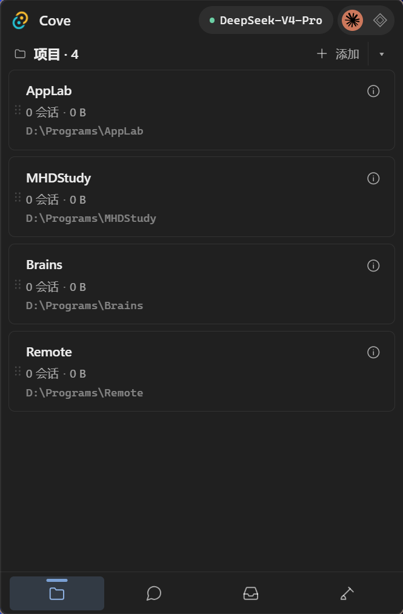
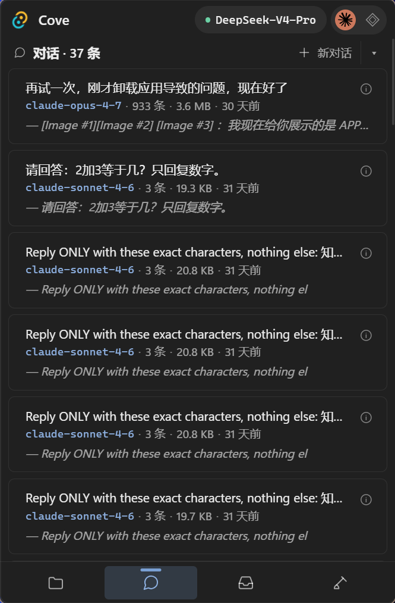
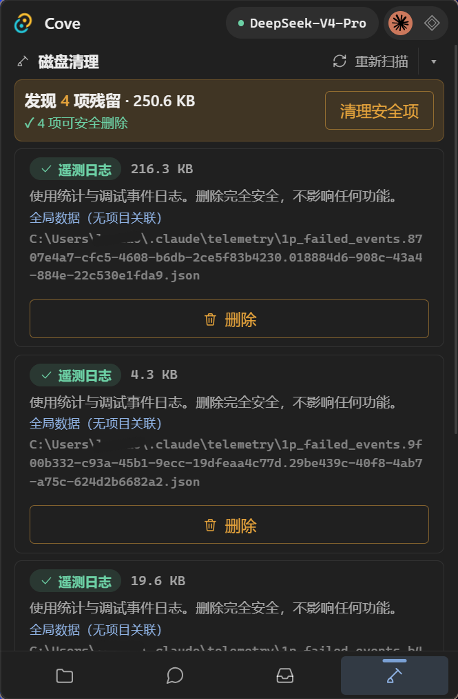
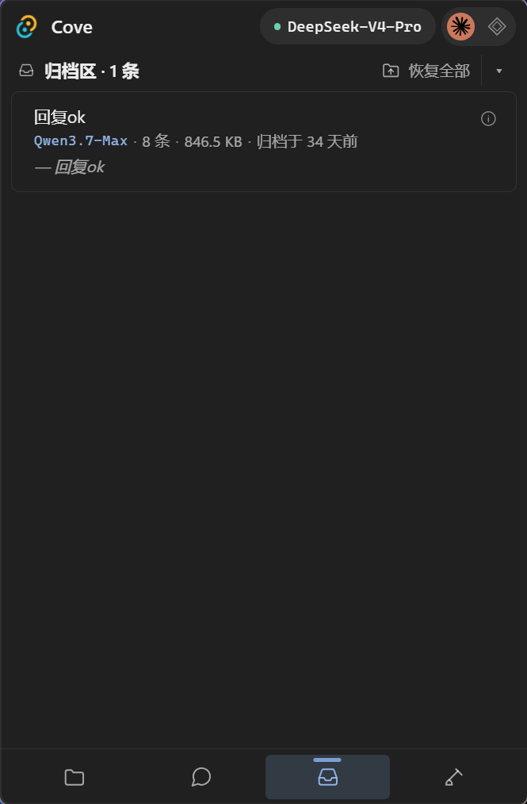
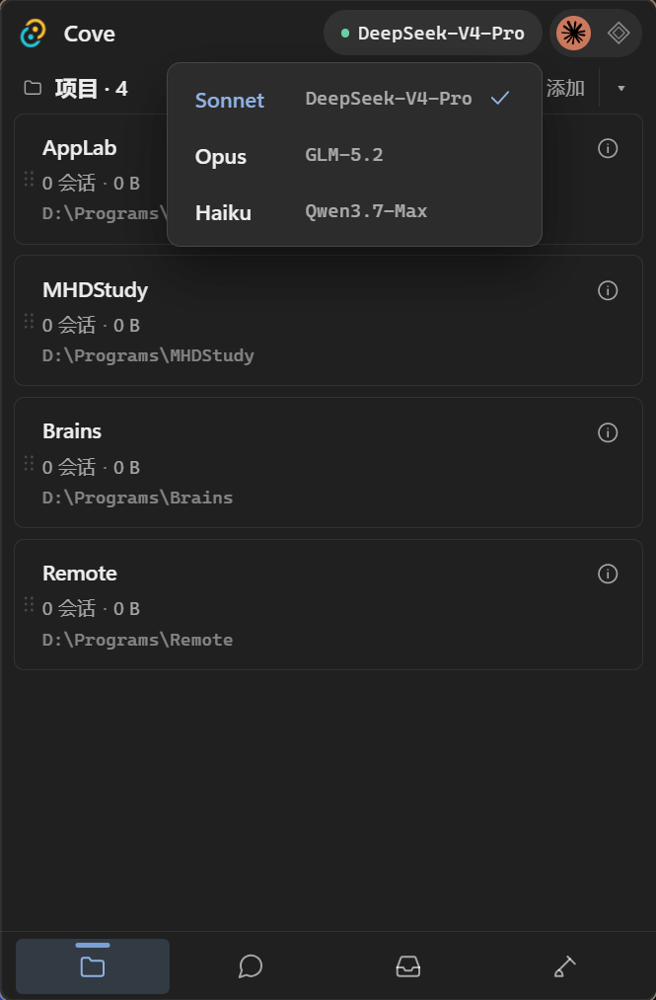
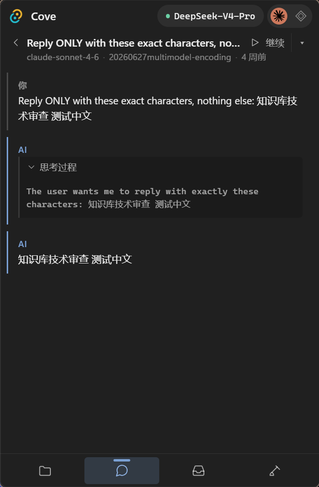
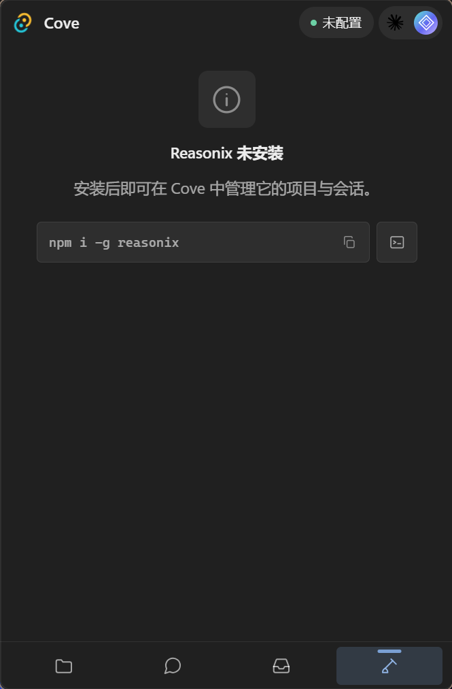

<div align="center">

# 🐬 Cove

**一个管理 Claude Code 与 Reasonix 项目和对话的 Windows 本地托盘应用。**

[下载便携版](https://github.com/LUMIAO9527/Cove/releases/latest/download/Cove.exe) · [最新版本](https://github.com/LUMIAO9527/Cove/releases/latest)

[](https://github.com/LUMIAO9527/Cove/releases/latest)
[](./LICENSE)
[](#隐私与数据)

[English](./README.md)

</div>

## Cove 能做什么

Cove 把项目、对话、归档和清理功能集中到一个紧凑的系统托盘面板中。它直接读取受支持编码工具产生的本地数据，不依赖云端服务。

- 浏览 Claude Code 和 Reasonix 的项目与对话。
- 查看、复制或导出完整对话记录。
- 调整项目顺序，从指定目录启动新对话。
- 软归档对话，并在需要时恢复。
- 永久删除对话及其关联的本地数据。
- 扫描 Claude Code 中正文已删除但附属数据仍残留的项目。
- 按时间分组批量归档或删除对话。

## 界面

| 预览 | 功能说明 |
| :---: | --- |
|  | **项目管理**：添加本地工作区、打开数据目录，并在托盘面板中调整项目顺序。 |
|  | **对话列表**：按标题、模型、消息数、大小和时间浏览项目中的会话。 |
|  | **残留清理**：删除前查看 Claude Code 关联残留及 Cove 给出的安全分类。 |
|  | **归档恢复**：查看已归档会话，并将其恢复到原始位置。 |
|  | **模型配置**：查看并切换 Claude Code 各模型档位当前使用的模型。 |
|  | **会话详情**：阅读完整对话、展开或折叠思考过程，并继续会话。 |
|  | **Reasonix**：检测 Reasonix 是否已经安装；未安装时显示安装指引。 |

## 安装

下载 [`Cove.exe`](https://github.com/LUMIAO9527/Cove/releases/latest/download/Cove.exe) 后直接运行。目前支持 Windows 10/11 x64。

Cove 常驻系统托盘。点击托盘图标打开面板，点击其他区域后自动隐藏。

## 隐私与数据

Cove 不包含遥测功能，也不会把项目或对话数据发送到 Cove 服务器。所有操作均在本机完成。

归档和删除操作会影响 Claude Code 或 Reasonix 使用的原始数据。如果以后可能需要恢复，请优先使用归档；永久删除无法通过 Cove 撤销。

## 从源码构建

需要 Node.js、Rust，以及 Tauri 在 Windows 上使用的 C++ 构建工具。

```powershell
git clone https://github.com/LUMIAO9527/Cove.git
cd Cove
npm install --include=dev
npm run tauri dev
```

生成发布版本：

```powershell
npm run tauri build
```

前端采用原生 TypeScript 与 Vite，桌面后端采用 Rust 与 Tauri。后端集成测试位于 `src-tauri/tests/`，可在 `src-tauri/` 下运行 `cargo test`。

## 仓库结构

```text
src/              前端视图、样式和 Tauri API 封装
src-tauri/src/    Rust 后端及各工具适配器
src-tauri/tests/  后端集成测试
```

## License

[MIT](./LICENSE)
